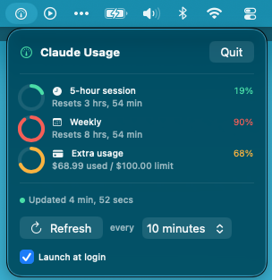
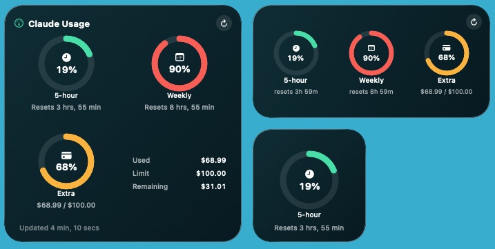

# Claude Usage Widget

A native macOS desktop widget that shows everything from
[claude.ai/settings/usage](https://claude.ai/settings/usage) at a glance:

- **5-hour session** utilization with live reset countdown
- **Weekly (7-day)** utilization with reset countdown
- **Extra-usage** credits (used / limit in USD)
- **Current remaining balance** of extra-usage credits
- A discreet **menu-bar icon** with configurable auto-refresh (1–15 min) and a manual refresh button

Reset countdowns animate every second so the widget always feels alive, even between polls.

<p align="center">
  <strong>Menu-bar popover</strong><br>
  
</p>

<p align="center">
  <strong>Desktop widgets (small, medium, large)</strong><br>
  
</p>

> ⚠️ **Unofficial endpoint.** There is no public API for consumer Claude usage. This project
> calls `https://api.anthropic.com/api/oauth/usage`, the same undocumented endpoint Claude Code
> uses internally. Anthropic could change or remove it without notice — if that happens the
> widget will simply show "No data yet" until it's updated.

---

## Requirements

| | |
|---|---|
| macOS | **14.0 Sonoma or later** (desktop widgets and interactive widget buttons require Sonoma) |
| Xcode | **16.0 or later** ([free download](https://apps.apple.com/app/xcode/id497799835)) |
| XcodeGen | `brew install xcodegen` |
| Claude Code | Installed and signed in (`claude /login` at least once) |
| Apple ID | Any free personal Apple ID works for signing — no paid Developer Program needed |

---

## Fresh install

### 1. Clone and generate the Xcode project

```bash
git clone <this-repo>
cd claude-usage-widget
xcodegen generate
```

`xcodegen generate` creates `ClaudeUsageWidget.xcodeproj` from `project.yml`. Run it once
before opening Xcode, and again after any `git pull` that changes `project.yml`.

### 2. Open in Xcode and set your team

```bash
open ClaudeUsageWidget.xcodeproj
```

In Xcode:

1. Click the **`ClaudeUsageWidget`** target in the project navigator → **Signing & Capabilities**
   → set **Team** to your personal Apple ID.
2. Do the same for the **`ClaudeUsageWidgetExtension`** target.

> **Tip:** Your team ID is saved in `project.yml` under `DEVELOPMENT_TEAM`. Set it once there
> so you don't have to re-enter it after future `xcodegen generate` runs:
> ```bash
> # find your team ID
> security find-identity -v -p codesigning | grep -o '([A-Z0-9]\{10\})' | head -1
> # then edit project.yml:  DEVELOPMENT_TEAM: "XXXXXXXXXX"
> ```

### 3. Build and run

Select the **`ClaudeUsageWidget`** scheme (top-left of the Xcode toolbar, next to the device
selector) and press **⌘R**.

Xcode will:
- Build both the host app and the widget extension.
- Launch the host app — a **gauge icon** appears in your menu bar.
- Register the widget extension with macOS.

### 4. Grant keychain access

On first launch, macOS prompts for access to the `Claude Code-credentials` keychain item.
Click **Always Allow** so the app doesn't ask again.

### 5. Add the widget to your desktop

1. Right-click an empty area on your desktop → **Edit Widgets…**
2. Search for **Claude Usage**.
3. Drag the size you want (small, medium, or large) onto the desktop.

The rings will populate within the first poll interval (default 5 minutes). Use the
**↻** button on the widget or in the menu-bar popover to trigger an immediate refresh.

### 6. (Optional) Start at login

Click the menu-bar gauge icon and tick **Launch at login**. The host app
uses `SMAppService.mainApp` (macOS 13+), so the toggle registers the app
itself — no helper bundle, no Login Items entitlement. macOS may ask you
to approve the login item once in **System Settings → General → Login
Items**; the menu-bar popover shows a hint when that's required.

To disable it later, untick the same toggle — or remove the entry from
**System Settings → General → Login Items** directly.

---

## Upgrading after a code change

```bash
cd claude-usage-widget
git pull

# Regenerate the project if project.yml changed
xcodegen generate
```

Then in Xcode press **⌘R** to rebuild and relaunch. WidgetKit will pick up the new widget
extension binary automatically — you don't need to remove and re-add the widget.

If the widgets look stale after a rebuild:

```bash
killall chronod 2>/dev/null; killall Dock
```

Then right-click the desktop → **Edit Widgets** → remove and re-add the widget.

---

## Rebuild from scratch

When Xcode, WidgetKit, or the widget extension registration gets into a weird
state (stale timeline, widget missing from Edit Widgets, duplicate menu-bar
icons), a full clean rebuild usually fixes it:

```bash
cd claude-usage-widget

# 1. Throw away the generated project and every build cache.
rm -rf ClaudeUsageWidget.xcodeproj
rm -rf "$HOME/Library/Developer/Xcode/DerivedData"/ClaudeUsageWidget-*

# 2. Ask the widget daemon and Dock to forget the old extension.
killall chronod 2>/dev/null || true
killall Dock    2>/dev/null || true

# 3. (Optional) confirm pluginkit has forgotten the old extension.
pluginkit -m -p com.apple.widgetkit-extension | grep -i claudeusage || echo "clean"

# 4. Regenerate the project and rebuild.
xcodegen generate
open ClaudeUsageWidget.xcodeproj
# …then press ⌘R in Xcode.
```

Once the host app has launched at least once, right-click the desktop →
**Edit Widgets** → search **Claude Usage** → drag the widget back on.

If you previously saw the "ClaudeUsageWidget would like to access data from
other apps" prompt, also run once after rebuilding:

```bash
tccutil reset All com.robert.ClaudeUsageWidget
```

---

## What each widget size shows

| Size   | Contents                                                                              |
|--------|---------------------------------------------------------------------------------------|
| Small  | 5-hour ring with % and live reset countdown                                           |
| Medium | All three rings (5-hour, weekly, extra-usage) with reset countdowns and cost figures, plus a refresh button |
| Large  | All three rings + info panel (Used / Limit / Remaining / Plan), header with plan badge and refresh button, last-updated footer |

---

## How it works

```
┌─────────────────────────────┐                ┌──────────────────────────┐
│  Host app (LSUIElement)     │  configurable  │  api.anthropic.com       │
│  ─ MenuBarExtra UI          │ ─────────────► │  /api/oauth/usage        │
│  ─ Poller.swift (1–15 min)  │                └──────────────────────────┘
│  ─ KeychainHelper           │                            │
│  ─ UsageService             │ ◄───── JSON ───────────────┘
└─────────────┬───────────────┘
              │ writes snapshot.json
              ▼
   ┌──────────────────────────────────────────────────┐
   │ Shared handoff directory                         │
   │ ~/Library/Containers/                            │
   │   com.robert.ClaudeUsageWidget.WidgetExtension/  │
   │   Data/Library/Application Support/              │
   │     ClaudeUsageWidget/snapshot.json              │
   │ (widget's own sandbox container —                │
   │  host writes require a one-time TCC Allow)       │
   └─────────────┬────────────────────────────────────┘
                 │ widget reads it as its own Application Support
                 ▼
   ┌──────────────────────────┐    interactive
   │ Widget extension         │ ◄── refresh    ┌──────────┐
   │ ─ TimelineProvider       │    button      │ User     │
   │ ─ Small/Medium/Large     │    (AppIntent) │ click    │
   └──────────────────────────┘                └──────────┘
```

The host↔widget handoff goes through the **widget extension's own sandbox
container**. This is counter-intuitive (every macOS tutorial tells you to
use an App Group), but it's the only path that actually works under the
constraints of this project:

- **App Groups are unavailable.** Free personal Apple teams can't
  provision `com.apple.security.application-groups`, so
  `~/Library/Group Containers/…` is off the table.
- **Temp-exception file entitlements get stripped at sign time.** We
  tried routing the handoff through `~/.claudeusagewidget/` with
  `com.apple.security.temporary-exception.files.home-relative-path.read-write`
  on the widget. The entitlement is present in the source
  `.entitlements` file, but `codesign -d --entitlements - Widget.appex`
  shows it's silently dropped during free-team signing. The widget
  sandbox then denies the read.
- **`~/Library/Application Support/` is inside `~/Library/`, which the
  widget sandbox can't reach** without the same kind of temp-exception
  entitlement that gets stripped.
- **The widget's own container is freely readable by the widget itself**
  (it's just its Application Support directory from inside the process).
  The catch is that on macOS Sonoma 14+, an unsandboxed process writing
  into another bundle's `~/Library/Containers/…` triggers the
  **"ClaudeUsageWidget would like to access data from other apps"** TCC
  dialog. It fires **once**, the user clicks Allow, and macOS remembers
  the decision keyed on the code signature.

The one-time TCC click is the price of avoiding App Groups. See the
troubleshooting section below for what to expect on first launch, and set
a stable `DEVELOPMENT_TEAM` in `project.yml` so the Allow decision
survives rebuilds. The host also writes a redundant copy into
`~/.claudeusagewidget/` as a no-TCC safety cache for local debugging —
the widget can't read it, but `ls` and external tools can.

See `Shared/SharedStore.swift` for the full write-target / read-fallback
logic.

### The OAuth call

```
GET https://api.anthropic.com/api/oauth/usage
Authorization: Bearer <token from "Claude Code-credentials" keychain entry>
anthropic-beta: oauth-2025-04-20
```

Sample response:

```json
{
  "five_hour":   { "utilization": 0.42, "resets_at": "2026-04-11T17:00:00Z" },
  "seven_day":   { "utilization": 0.61, "resets_at": "2026-04-17T03:00:00Z" },
  "extra_usage": {
    "is_enabled": true,
    "used_credits": 6417,
    "monthly_limit": 10000,
    "currency": "USD"
  }
}
```

`used_credits` and `monthly_limit` are in **cents**:

```
balance_usd = (monthly_limit - used_credits) / 100   →   $35.83
```

A second best-effort call to `/api/oauth/profile` retrieves the plan name (Pro / Max) shown
in the Large widget header.

### Refresh strategy

WidgetKit gives each widget a daily reload budget (~40–70 reloads/day, minimum ~15 minutes
between system-driven entries). To keep the widget feeling live:

- **The host app polls on a configurable timer** (default 5 min) while it's running, writes
  the latest snapshot to the widget's container, and calls
  `WidgetCenter.shared.reloadTimelines(ofKind:)`. macOS redraws within ~1 minute.
- **Reset countdowns use `Text(date, style: .relative)`**, which animates every second on its
  own — no timeline reload needed.
- **The ↻ refresh button** on the widget runs an `AppIntent` that fetches directly from
  inside the widget extension and asks WidgetKit to reload immediately.

If the host app isn't running, the widget falls back to the timeline's own 15-minute reload
schedule, drawing the most recent cached snapshot with a small "stale" indicator.

---

## Project layout

```
claude-usage-widget/
├── App/                          # Host app target
│   ├── ClaudeUsageWidgetApp.swift
│   ├── MenuBarView.swift
│   ├── Poller.swift
│   ├── Info.plist
│   └── ClaudeUsageWidget.entitlements
├── Widget/                       # Widget extension target
│   ├── ClaudeUsageWidgetBundle.swift
│   ├── ClaudeUsageWidget.swift
│   ├── UsageProvider.swift
│   ├── UsageEntry.swift
│   ├── RefreshIntent.swift
│   ├── Views/
│   │   ├── SmallWidgetView.swift
│   │   ├── MediumWidgetView.swift
│   │   ├── LargeWidgetView.swift
│   │   └── WidgetPrimitives.swift
│   ├── Info.plist
│   └── ClaudeUsageWidgetExtension.entitlements
├── Shared/                       # Compiled into BOTH targets
│   ├── UsageSnapshot.swift
│   ├── UsageService.swift
│   ├── CredentialsProvider.swift
│   ├── KeychainHelper.swift
│   ├── SharedStore.swift
│   ├── Theme.swift
│   └── RingView.swift
├── Resources/Assets.xcassets/
├── project.yml                   # XcodeGen spec — DEVELOPMENT_TEAM lives here
├── LICENSE
└── README.md
```

---

## Troubleshooting

### "No data yet" / empty rings

The host app couldn't fetch data. In order:

1. Make sure the host app is running — look for the gauge icon in the menu bar. If it's not
   there, open `ClaudeUsageWidget.app` (or press ⌘R in Xcode).
2. Click the menu-bar icon and check the status message at the bottom.
3. If it says "Not authenticated": run `claude /login` in your terminal, then click **Refresh**
   in the menu.
4. Verify the keychain entry exists:
   ```bash
   security find-generic-password -s "Claude Code-credentials"
   ```

### Widget doesn't appear in Edit Widgets

1. The host app must have been launched at least once after the build (this registers the
   extension with macOS).
2. If it still doesn't appear:
   ```bash
   killall chronod 2>/dev/null; killall Dock
   ```
   Then re-open Edit Widgets and search again.
3. If it still doesn't appear, in Xcode verify that the **ClaudeUsageWidgetExtension** target's
   entitlements include `com.apple.security.app-sandbox = YES` (Signing & Capabilities tab).

### Numbers are stuck / "stale" badge

The host app hasn't fetched recently. Click the menu-bar icon to see the exact error. Common
causes: the app was quit, the network is down, or the token expired. Click **Refresh** to
retry immediately.

### 401 Unauthorized

Your OAuth token expired. Run `claude /login` again — Claude Code will refresh the keychain
entry and the widget picks up the new token on the next poll.

### Keychain prompt keeps appearing

Open **System Settings → Privacy & Security → Keychain Access**, find `Claude Code-credentials`,
and add `ClaudeUsageWidget` to its access control list. Click **Always Allow** in the prompt.

### "ClaudeUsageWidget would like to access data from other apps"

This is a **different** dialog from the keychain prompt above. It is a TCC
(Transparency, Consent, and Control) prompt that macOS Sonoma 14+ shows
whenever an unsandboxed app reads or writes another app's
`~/Library/Containers/…` directory.

**On this project, the prompt is expected to appear exactly once on first
launch after install.** Click **Allow**. The host app needs to write the
snapshot file into the widget extension's sandbox container as its
handoff path — see the "Architecture" section above for why every other
option is blocked by free-team signing constraints. macOS remembers your
Allow decision keyed to the app's code signature, so subsequent launches
are silent.

If the prompt keeps re-appearing on every launch, your code signature is
changing between builds. Two fixes, in order:

1. **Set a stable `DEVELOPMENT_TEAM` in `project.yml`.** Find your team
   ID via Xcode → Settings → Accounts → (your account) → Manage
   Certificates, or the output of
   `security find-identity -v -p codesigning`. Add it under
   `settings.base`:
   ```yaml
   settings:
     base:
       DEVELOPMENT_TEAM: YOURTEAMID
   ```
   Regenerate with `xcodegen generate` and rebuild. All subsequent
   builds will sign with the same identity and TCC will stop re-asking.

2. **Reset the existing TCC decision once**, in case macOS cached a
   decision tied to a stale signature:
   ```bash
   tccutil reset All com.robert.ClaudeUsageWidget
   tccutil reset All com.robert.ClaudeUsageWidget.WidgetExtension
   killall chronod 2>/dev/null; killall Dock
   ```
   Relaunch the host app, click **Allow** one more time — that decision
   will now be keyed to the stable signature from step 1.

If you want a completely prompt-free install you need a paid Apple
Developer account, which would let you provision an App Group and route
the handoff through `~/Library/Group Containers/…` instead.

### "The endpoint changed and now everything is broken"

Anthropic can change the OAuth endpoint or beta header at any time. The fix is usually a
one-line change in `Shared/UsageService.swift`. Issues and PRs are welcome.

---

## Complete uninstall

The app writes to several locations. Run the block below top-to-bottom to
remove every artifact including build caches, widget registration, TCC
decisions, and optionally the source checkout itself.

```bash
# 1. Quit the app and make sure nothing is left running.
pkill -x ClaudeUsageWidget 2>/dev/null || true

# 2. Unregister the widget extension from macOS.
#    chronod is the system daemon that hosts desktop widgets.
pluginkit -r "$HOME/Library/Developer/Xcode/DerivedData"/ClaudeUsageWidget-*/Build/Products/Debug/ClaudeUsageWidget.app/Contents/PlugIns/ClaudeUsageWidgetExtension.appex 2>/dev/null || true
killall chronod 2>/dev/null || true
killall Dock    2>/dev/null || true

# 3. Delete the built app (only exists if you copied it out of DerivedData).
rm -rf /Applications/ClaudeUsageWidget.app

# 4. Delete cached snapshot, token, and container data.
rm -rf "$HOME/.claudeusagewidget"
rm -rf "$HOME/Library/Application Support/ClaudeUsageWidget"
rm -rf "$HOME/Library/Containers/com.robert.ClaudeUsageWidget"
rm -rf "$HOME/Library/Containers/com.robert.ClaudeUsageWidget.WidgetExtension"
rm -rf "$HOME/Library/Group Containers/group.com.robert.claude-usage-widget"

# 5. Delete saved preferences (poll interval, window state).
defaults delete com.robert.ClaudeUsageWidget 2>/dev/null || true
rm -f "$HOME/Library/Preferences/com.robert.ClaudeUsageWidget.plist"
rm -f "$HOME/Library/Preferences/com.robert.ClaudeUsageWidget.WidgetExtension.plist"

# 6. Delete Xcode build artifacts.
rm -rf "$HOME/Library/Developer/Xcode/DerivedData"/ClaudeUsageWidget-*

# 7. Reset any TCC decisions the app accumulated
#    (needed if you ever saw the "access data from other apps" prompt).
tccutil reset All com.robert.ClaudeUsageWidget                 2>/dev/null || true
tccutil reset All com.robert.ClaudeUsageWidget.WidgetExtension 2>/dev/null || true

# 8. Delete the generated Xcode project (xcodegen regenerates it).
rm -rf ClaudeUsageWidget.xcodeproj

# 9. (Optional) Delete the source checkout itself.
cd .. && rm -rf claude-usage-widget
```

Notes:

- The keychain entry `Claude Code-credentials` belongs to Claude Code, **not**
  to this widget. Do NOT delete it unless you also want to sign out of
  Claude Code.
- Step 2's `pluginkit -r` is best-effort; if DerivedData has already been
  deleted, `killall chronod` alone is enough for macOS to forget the widget
  on its next launch.

---

## Limitations & non-goals

- **macOS 14+ only** — desktop widgets and interactive AppIntent buttons require Sonoma.
- **No Notification Center widget** — desktop only by design.
- **No Opus-only ring** — the field is parsed but not displayed.
- **No iCloud sync, no multi-account.**
- **No auto-updater** — `git pull` + `xcodegen generate` + ⌘R.

---

## Credits & prior art

Community tools that reverse-engineered the undocumented OAuth endpoint:

- [TokenEater](https://github.com/AThevon/TokenEater) — architecture template (host app + widget
  extension + shared container) and the `kSecUseAuthenticationUISkip` keychain pattern.
- [ClaudeUsageWidget](https://github.com/dependentsign/ClaudeUsageWidget) — first to demonstrate
  the `getpwuid` trick for reading `~/.claude/` from inside a sandboxed widget extension.
- [ccstatusline](https://github.com/ohugonnot/claude-code-statusline) — shell-script reference
  implementation of the OAuth call.
- [Tray-Usage-Monitor](https://github.com/Firnschnee/Tray-Usage-Monitor) — Windows equivalent,
  useful as a reference for response shapes and refresh strategy.

---

## License

MIT — see [LICENSE](./LICENSE).
